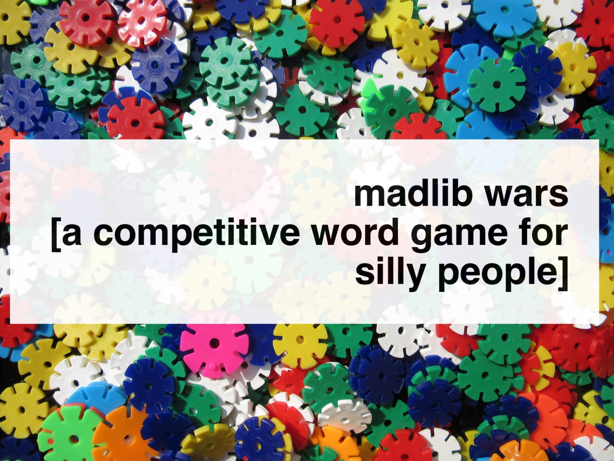

# gameproject

### Madlib Wars - 1st Version ###

### Javascript-based competitive word game with an artistic and minimalist style

Teams take turns coming up with various words to compete at making madlibs. Each team is given several prompts in which they get to select words at random. Each teams words are then arranged via Javascript into a madlib and displayed on the screen. After both teams madlibs are displayed, two selected judges award points to the teams based on the categories of originality, humor, and overall performance. Both teams can receive up to 3 points for each category. The first team to reach 5 points has has the winning madlib and wins the game.

### Development Process

Technologies used: HTML / CSS / Javascript / jQuery

Variables such as "noun" and "adjective" are created to signify what kind of words the teams need to choose. After the teams input their words and the code displays their selections, a new integrated block of text which is used as the final madlib appears in a separate div for each team. Team buttons are set up so that when either one of the buttons is clicked 5 times, an animation dispalys the respective winner.

### Future Versions

In the future, this project will be remade so the prompts are replaced by a form that enables each team to fill out their words of choice.   Another version of the project will also be developed into a digital card game in which cards are created that contain various nouns, verbs, adjectives, cities, animals, body parts, etc. The users can randomly choose the digital cards that they see fit, creating a madlib that is then displayed on screen. Think Cards Against Humanity but for Madlibs, only digital. I would also like to create a version of this project in which people from all over the world are able to play Madlib Wars with each other online.

### User Stories

-I would like two different teams to be able to compete with each other. 
-I would like the judges to vote on different categories such as humor and originality. 
-I would like to hear a sound when the teams score points. 
-I would like each teams madlibs to appear next to each other so the judges can compare them directly.

            .-""""-.       .-""""-.
           /        \     /        \
          /_        _\   /_        _\
         // \      / \\ // \      / \\
         |\__\    /__/| |\__\    /__/|
          \    ||    /   \    ||    /
           \        /     \        /
            \  __  /       \  __  /
    .-""""-. '.__.'.-""""-. '.__.'.-""""-.
 
